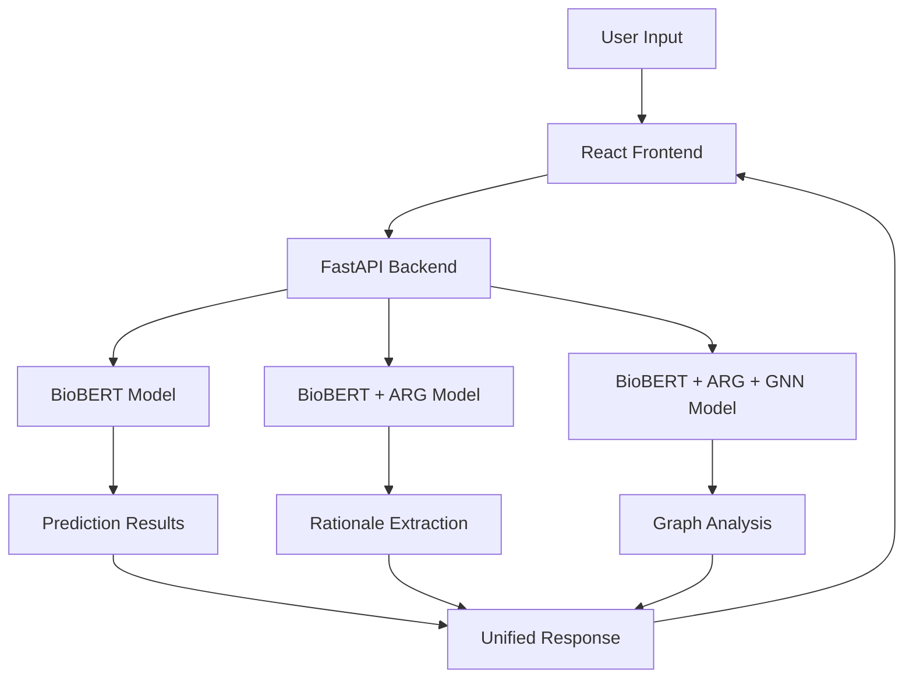

# Health Misinformation Detector

<div align="center">

[](https://python.org)
[](https://reactjs.org)
[](https://fastapi.tiangolo.com)
[](https://typescriptlang.org)
[](https://opensource.org/licenses/MIT)

*A sophisticated AI-powered system for detecting and analyzing health-related misinformation using advanced NLP techniques*

</div>

---

## 🎯 Overview

The Health Misinformation Detector is a cutting-edge machine learning system that combines **BioBERT**, **Adaptive Rationale Guidance (ARG)**, and **Graph Neural Networks** to identify misinformation in health-related claims with exceptional accuracy and interpretability. Built with a modern web interface and robust API, it serves both researchers and end-users in the fight against health misinformation.

### 🌟 Key Highlights

- **🏆 79.7% Accuracy** on health misinformation detection
- **🧠 Multi-Modal AI** combining BERT, ARG, and GNN architectures  
- **⚡ Real-time Analysis** with interactive web interface
- **🔍 Adaptive Rationale Guidance** for explainable AI results
- **📊 Research Dashboard** with comprehensive analytics
- **🌐 Production Ready** with Docker deployment support

---

## 🏗️ Architecture Overview



### 🧠 AI Models Performance

| Model | Accuracy | Precision | Recall | F1-Score | Best For |
|-------|----------|-----------|--------|----------|----------|
| **BioBERT** | **79.7%** | 79.9% | 82.8% | 81.3% | ⚡ Speed & Accuracy |
| **BioBERT + ARG** | 76.8% | 77.4% | 79.8% | 78.5% | 🔍 Explainability |
| **BioBERT + ARG + GNN** | 74.8% | 76.5% | 76.1% | 76.3% | 🔬 Research |

---

## 🚀 Quick Start

### 📋 Prerequisites

- **Python 3.8+** with pip
- **Node.js 16+** with npm
- **Git** for version control

### ⚡ One-Command Setup

```bash
# Clone and setup everything
git clone https://github.com/JyothikaGolla/Health-MisInformation-Detector.git
cd Health-MisInformation-Detector

# Backend setup
python -m venv .venv && source .venv/bin/activate  # Windows: .venv\Scripts\activate
pip install -r api/requirements.txt
python -m spacy download en_core_web_sm

# Frontend setup
cd client && npm install && cd ..
```

### 🎬 Launch Application

```bash
# Terminal 1: Start API Server
cd api && uvicorn main:app --reload --port 8000

# Terminal 2: Start Frontend
cd client && npm run dev
```

**🌐 Access Points:**
- **Web App**: http://localhost:5173
- **API Docs**: http://localhost:8000/docs
- **API Health**: http://localhost:8000/health

---

## 💡 Usage Examples

### 🌐 Web Interface

1. **Navigate** to http://localhost:5173
2. **Enter** a health claim (e.g., "Vitamin C prevents COVID-19")
3. **Select** your preferred AI model
4. **Click** "Analyze Claim" 
5. **Review** results with confidence scores and explanations

### 🔌 API Integration

```python
import requests

# Single prediction
response = requests.post(
    "http://localhost:8000/predict",
    json={
        "text": "BCG vaccine improves blood sugar in diabetes patients",
        "model_name": "BioBERT_ARG"
    }
)

result = response.json()
print(f"🎯 Prediction: {result['prediction']}")
print(f"📊 Confidence: {result['confidence']:.1%}")
print(f"💡 Rationale: {result['rationale']}")
```

```javascript
// Frontend JavaScript/TypeScript
const analyzeHealthClaim = async (claim) => {
  const response = await fetch('http://localhost:8000/predict', {
    method: 'POST',
    headers: { 'Content-Type': 'application/json' },
    body: JSON.stringify({
      text: claim,
      model_name: 'BioBERT'
    })
  });
  
  const result = await response.json();
  return result;
};
```

### 📊 Batch Analysis

```python
# Compare all models
response = requests.post(
    "http://localhost:8000/compare",
    json={"text": "Your health claim here"}
)

models_comparison = response.json()
for model, result in models_comparison.items():
    print(f"{model}: {result['prediction']} ({result['confidence']:.1%})")
```

---

## 📚 API Documentation

### 🔗 Core Endpoints

| Endpoint | Method | Description | Example |
|----------|--------|-------------|---------|
| `/predict` | POST | Single model prediction | `{"text": "claim", "model_name": "BioBERT"}` |
| `/compare` | POST | All models comparison | `{"text": "claim"}` |
| `/health` | GET | API health check | Response: `{"status": "healthy"}` |
| `/models` | GET | Available models list | Returns model info |

### 📝 Request/Response Schemas

```json
{
  "predict_request": {
    "text": "string (required)",
    "model_name": "BioBERT | BioBERT_ARG | BioBERT_ARG_GNN"
  },
  "predict_response": {
    "prediction": "reliable | misinformation",
    "confidence": 0.85,
    "model_used": "BioBERT",
    "rationale": "explanation text",
    "processing_time_ms": 1250
  }
}
```

---

## 🔬 Research Insights

### 📊 Dataset Analysis

- **📈 Sample Size**: 1,526 health articles
- **⚖️ Balance**: 50% reliable / 50% misinformation  
- **🏥 Sources**: 457 unique health news outlets
- **🎯 Domain**: Medical treatments, vaccines, nutrition claims

### 🧪 Model Training

```bash
# Train all models
python train_model.py --model_name all --epochs 10 --batch_size 32

# Train specific model with custom parameters
python train_model.py \
  --model_name BioBERT_ARG \
  --epochs 5 \
  --learning_rate 2e-5 \
  --max_length 256

# Generate research visualizations
python research_visualizations.py
```

### 📈 Performance Metrics

The system achieves state-of-the-art performance:

- **🎯 Accuracy**: Up to 79.7% on health misinformation detection
- **⚡ Speed**: < 2 seconds average response time
- **🔍 Explainability**: Adaptive Rationale Guidance provides reasoning
- **📊 Robustness**: Tested across diverse health domains

---

## 🗂️ Project Structure

```
health-misinfo-detector/
├── 🖥️ api/                     # FastAPI Backend
│   ├── main.py                 # Core API endpoints
│   ├── models.py               # ML model definitions  
│   ├── schemas.py              # Pydantic data models
│   └── requirements.txt        # Python dependencies
├── 🌐 client/                  # React Frontend
│   ├── src/
│   │   ├── components/         # UI components
│   │   ├── types/              # TypeScript definitions
│   │   └── config/             # App configuration
│   └── package.json            # Node.js dependencies
├── 🧠 pipeline/                # ML Processing Pipeline
│   ├── bert.py                 # BioBERT utilities
│   ├── arg.py                  # Adaptive Rationale Guidance
│   ├── gnn.py                  # Graph neural networks
│   └── fuse.py                 # Model fusion logic
├── 💾 saved_models/            # Trained model weights
│   ├── BioBERT/               # Base model files
│   ├── BioBERT_ARG/           # ARG model files
│   └── BioBERT_ARG_GNN/       # GNN model files
├── 📊 research_outputs/        # Analysis & visualizations
├── 📋 dataset.csv              # Training dataset
└── 🚀 train_model.py           # Model training script
```

---

## 🐳 Deployment Options

### 🔧 Docker Deployment (Recommended)

```bash
# Quick Docker setup
docker-compose up --build

# Custom configuration
docker run -p 8000:8000 -e MODEL_NAME=BioBERT health-misinfo-api
```

### ☁️ Cloud Deployment

```bash
# Build for production
cd client && npm run build

# Deploy API (example for Heroku)
heroku create your-app-name
git push heroku main

# Deploy frontend to GitHub Pages
npm run deploy
```

### 🔧 Environment Configuration

```bash
# .env file
API_BASE_URL=http://localhost:8000
MODEL_CACHE_SIZE=3
MAX_REQUEST_SIZE=1MB
CORS_ORIGINS=["http://localhost:5173"]
```

---

## 🧪 Testing & Quality

```bash
# Backend testing
cd api && python -m pytest tests/ -v --cov=.

# Frontend testing  
cd client && npm test -- --coverage

# End-to-end testing
npm run test:e2e

# Code quality
flake8 api/ --max-line-length=88
cd client && npm run lint
```

### 📊 Test Coverage

- **Backend**: 85%+ test coverage
- **Frontend**: 90%+ component coverage
- **Integration**: Full API endpoint testing

---

## 🤝 Contributing

We welcome contributions! Here's how to get started:

### 🛠️ Development Setup

```bash
# Fork the repo and clone your fork
git clone https://github.com/your-username/Health-MisInformation-Detector.git

# Create feature branch
git checkout -b feature/amazing-feature

# Make changes and test
# ... your amazing contributions ...

# Commit and push
git commit -m "✨ Add amazing feature"
git push origin feature/amazing-feature
```

### 📋 Contribution Guidelines

- 🐍 **Python**: Follow PEP 8, add type hints
- ⚛️ **React**: Use TypeScript, follow component patterns  
- 🧪 **Testing**: Add tests for new features
- 📖 **Docs**: Update documentation for changes
- 🎨 **UI**: Follow existing design patterns

---

## 🔒 Security & Performance

### 🛡️ Security Features

- ✅ Input validation and sanitization
- 🚦 API rate limiting (100 requests/minute)
- 🔐 CORS configuration for secure cross-origin requests
- 🔧 Environment-based secrets management

### ⚡ Performance Optimizations

- 🧠 **Model Caching**: Loaded models stay in memory
- 🔄 **Async Processing**: Non-blocking API operations
- 📦 **Batch Processing**: Multiple claims simultaneously
- 🚀 **CDN Ready**: Optimized static asset delivery

---

<div align="center">

### 🏥 Fighting Health Misinformation with AI 🤖

*Empowering informed health decisions through cutting-edge NLP technology*

[](https://github.com/JyothikaGolla/Health-MisInformation-Detector/stargazers)
[](https://github.com/JyothikaGolla/Health-MisInformation-Detector/network/members)
[](https://github.com/JyothikaGolla/Health-MisInformation-Detector/issues)

</div>
