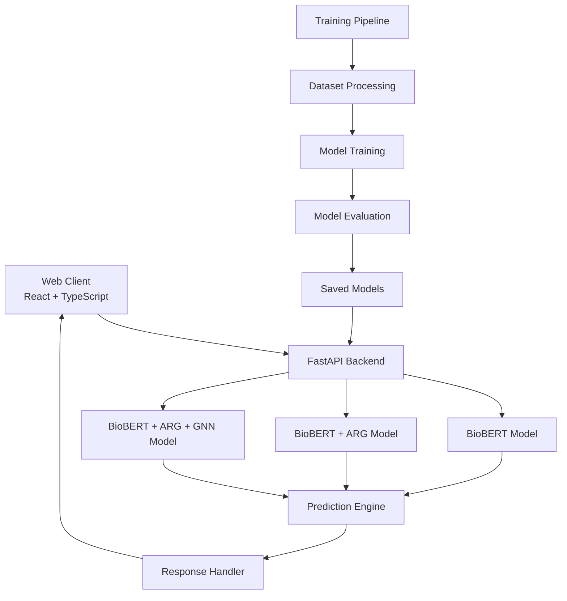

# Health MisInfo Detector

<div align="center">


**🔬 AI-powered platform for detecting health misinformation using advanced NLP and Graph Neural Networks**

[Demo](https://jyothikagolla.github.io/Health-MisInformation-Detector/) • [API Docs](http://localhost:8000/docs) • [Report Issues](https://github.com/JyothikaGolla/Health-MisInformation-Detector/issues)

</div>

---

## 🎯 Overview

Health MisInfo Detector is a comprehensive full-stack application that identifies and explains health misinformation in user-submitted claims. Built with cutting-edge machine learning models including BioBERT, Adaptive Rationale Guidance (ARG), and Graph Neural Networks (GNN), it provides accurate predictions with detailed explanations and confidence scores.

### Key Capabilities
- **Multi-Modal Analysis**: Combines transformer models, argument mining, and graph-based reasoning
- **Explainable AI**: Provides rationales and highlights key terms in predictions
- **Real-time Processing**: Fast inference with pre-trained models
- **Interactive Visualizations**: Rich dashboard for exploring model outputs
- **Robust Architecture**: Production-ready with comprehensive error handling

## ✨ Features

### 🤖 Advanced ML Models
- **BioBERT**: Biomedical language understanding with domain-specific training
- **BioBERT + ARG**: Enhanced with Adaptive Rationale Guidance for better reasoning
- **BioBERT + ARG + GNN**: Full pipeline with Graph Neural Networks for complex relationship modeling

### 📊 Interactive Analytics
- Real-time confidence scoring and prediction visualization
- Comparative analysis across multiple models
- Key term highlighting and rationale extraction
- Performance metrics and model insights

### 🎨 Modern Web Interface
- Responsive React + TypeScript frontend with Tailwind CSS
- Interactive charts and visualizations using Recharts
- Mobile-optimized design with professional UI/UX
- Dark theme with accessibility features

### 🔧 Developer Experience
- Comprehensive FastAPI backend with automatic OpenAPI documentation
- Type-safe interfaces with Pydantic models
- Environment-based configuration
- Docker support for containerized deployment

## 🏗️ Architecture



### Prerequisites

- **Python**: 3.11 or higher
- **Node.js**: 18.0 or higher
- **npm**: 9.0 or higher

### Installation

1. **Clone the repository**
   ```bash
   git clone https://github.com/JyothikaGolla/Health-MisInformation-Detector.git
   cd Health-MisInformation-Detector
   ```

2. **Backend Setup**
   ```bash
   # Create virtual environment
   python -m venv .venv
   
   # Activate virtual environment
   # Windows
   .\.venv\Scripts\Activate.ps1
   # Unix/MacOS
   source .venv/bin/activate
   
   # Install dependencies
   pip install -r api/requirements.txt
   
   # Download spaCy model
   python -m spacy download en_core_web_sm
   ```

3. **Frontend Setup**
   ```bash
   cd client
   npm install
   cd ..
   ```

4. **Environment Configuration**
   ```bash
   # Copy environment template
   cp .env.example .env
   
   # Edit .env with your configurations
   # OPENAI_API_KEY=your_openai_key (optional)
   # VITE_API_URL=http://localhost:8000
   ```

### Running the Application

1. **Start the API Server**
   ```bash
   uvicorn api.main:app --host 0.0.0.0 --port 8000 --reload
   ```

2. **Start the Web Client**
   ```bash
   cd client
   npm run dev
   ```

3. **Access the Application**
   - 🌐 **Web Interface**: http://localhost:5173
   - 📚 **API Documentation**: http://localhost:8000/docs
   - 🔧 **Health Check**: http://localhost:8000/health

### Docker Deployment (Optional)

```bash
# Build and run with Docker Compose
docker-compose up --build

# Or build manually
cd api
docker build -t health-misinfo-api .
docker run -p 8000:8000 health-misinfo-api
```
## 📚 API Reference

### Core Endpoints

#### Health Check
```http
GET /health
```
Returns API status and loaded models information.

**Response:**
```json
{
  "status": "healthy",
  "models_loaded": 3,
  "device": "cpu"
}
```

#### Predict Misinformation
```http
POST /predict
Content-Type: application/json
```

**Request Body:**
```json
{
  "text": "Vitamin C prevents COVID-19 completely",
  "model_name": "BioBERT_ARG_GNN"
}
```

**Parameters:**
- `text` (string, required): Health claim to analyze
- `model_name` (string, required): Model to use for prediction
  - `BioBERT`: Base biomedical BERT model
  - `BioBERT_ARG`: Enhanced with Adaptive Rationale Guidance
  - `BioBERT_ARG_GNN`: Full pipeline with Graph Neural Networks

**Response:**
```json
{
  "prediction": 0.12,
  "confidence": 0.88,
  "label": "misinformation",
  "probabilities": {
    "misinformation": 0.88,
    "reliable": 0.12
  },
  "rationales": [[0, 7], [17, 26]],
  "model_used": "BioBERT_ARG_GNN"
}
```

#### API Information
```http
GET /
```
Returns comprehensive API information and available models.

### Error Handling

All endpoints return standardized error responses:

```json
{
  "detail": "Error description",
  "status_code": 400
}
```

Common status codes:
- `200`: Success
- `400`: Bad Request (invalid input)
- `422`: Validation Error
- `500`: Internal Server Error

## 🎨 Web Interface

### Features
- **Real-time Analysis**: Submit health claims and get instant predictions
- **Model Comparison**: Compare results across different models simultaneously
- **Visual Insights**: Interactive charts showing confidence scores and probabilities
- **Rationale Highlighting**: Key terms and phrases that influenced the prediction
- **Responsive Design**: Optimized for desktop, tablet, and mobile devices

### Usage Examples

1. **Single Model Analysis**
   - Enter a health claim in the text area
   - Select your preferred model
   - Click "Analyze Claim" to get detailed results

2. **Multi-Model Comparison**
   - Use the "Compare Models" feature
   - View side-by-side results from all available models
   - Analyze consensus and disagreements between models

3. **Sample Claims**
   - Try pre-loaded example claims to explore functionality
   - Covers various types of health misinformation scenarios

## Model Training
- Training scripts in `train_model.py` and `pipeline/` for custom model development.
- Pretrained models stored in `saved_models/`.
- Dataset in `dataset.csv`.

## Project Structure
```
├── api/                # FastAPI backend, ML models, schemas
├── client/             # React web client
├── pipeline/           # Model pipeline components (BERT, GNN, ARG)
├── saved_models/       # Pretrained model weights and metrics
├── scripts/            # Utilities for evaluation and setup
├── dataset.csv         # Health claims dataset
├── train_model.py      # Model training script
└── README.md           # Project documentation
```
## 🧠 Model Training & Development

### Dataset
- **Health claims dataset**: 1,526 samples with balanced distribution
- **Sources**: 457 unique sources including medical journals, news articles, and social media
- **Labels**: Binary classification (reliable vs. misinformation)
- **Format**: CSV with text, label, and metadata columns

### Training Process

1. **Data Preprocessing**
   ```bash
   python train_model.py --preprocess --dataset dataset.csv
   ```

2. **Model Training**
   ```bash
   # Train BioBERT baseline
   python train_model.py --model biobert --epochs 10 --batch_size 16
   
   # Train with ARG enhancement
   python train_model.py --model biobert_arg --epochs 15 --batch_size 12
   
   # Train full pipeline with GNN
   python train_model.py --model biobert_arg_gnn --epochs 20 --batch_size 8
   ```

3. **Model Evaluation**
   ```bash
   python scripts/evaluate.py --model_path saved_models/BioBERT_ARG_GNN/
   ```

### Model Performance

| Model | Accuracy | Precision | Recall | F1-Score | Parameters |
|-------|----------|-----------|--------|----------|------------|
| BioBERT | 79.7% | 79.9% | 82.8% | 81.3% | 110M |
| BioBERT + ARG | 76.8% | 77.4% | 79.8% | 78.5% | 115M |
| BioBERT + ARG + GNN | 74.8% | 76.5% | 76.1% | 76.3% | 118M |

### Pipeline Components

#### 1. BioBERT Base
- Pre-trained on biomedical literature (PubMed abstracts)
- Fine-tuned for health misinformation classification
- Provides strong baseline performance

#### 2. Adaptive Rationale Guidance (ARG)
- Identifies key phrases that support predictions
- Enhances model interpretability
- Improves reasoning quality

#### 3. Graph Neural Networks (GNN)
- Models relationships between medical concepts
- Uses dependency parsing and named entity recognition
- Captures complex semantic interactions

### Custom Training

To train on your own dataset:

1. **Prepare Data**
   ```python
   # Format: CSV with columns 'text', 'label'
   # label: 0 = reliable, 1 = misinformation
   ```

2. **Configure Training**
   ```python
   # Edit train_model.py parameters
   EPOCHS = 15
   BATCH_SIZE = 16
   LEARNING_RATE = 2e-5
   MAX_LENGTH = 512
   ```

3. **Monitor Training**
   ```bash
   # Training outputs metrics and saves best model
   tensorboard --logdir ./logs
   ```

## 📁 Project Structure

```
Health-MisInformation-Detector/
├── 📂 api/                          # FastAPI Backend
│   ├── main.py                      # Main application & API routes
│   ├── models.py                    # ML model definitions
│   ├── schemas.py                   # Pydantic data models
│   ├── requirements.txt             # Python dependencies
│   └── Dockerfile                   # Container configuration
│
├── 📂 client/                       # React Frontend
│   ├── 📂 src/
│   │   ├── App.tsx                  # Main React component
│   │   ├── 📂 components/           # Reusable UI components
│   │   │   ├── ClaimForm.tsx        # Claim input form
│   │   │   ├── PropGraph.tsx        # Probability visualizations
│   │   │   ├── RationaleCard.tsx    # Rationale displays
│   │   │   └── ScoreBadge.tsx       # Confidence score badges
│   │   ├── 📂 types/                # TypeScript type definitions
│   │   └── 📂 config/               # Configuration files
│   ├── package.json                 # Node.js dependencies
│   ├── tailwind.config.js           # Tailwind CSS configuration
│   └── vite.config.ts               # Vite build configuration
│
├── 📂 pipeline/                     # ML Pipeline Components
│   ├── __init__.py                  # Package initialization
│   ├── bert.py                      # BioBERT encoding utilities
│   ├── arg.py                       # Adaptive Rationale Guidance
│   ├── gnn.py                       # Graph Neural Network models
│   └── fuse.py                      # Multi-modal fusion logic
│
├── 📂 saved_models/                 # Pre-trained Model Artifacts
│   ├── 📂 BioBERT/                  # Base BioBERT model
│   ├── 📂 BioBERT_ARG/              # BioBERT + ARG model
│   └── 📂 BioBERT_ARG_GNN/          # Full pipeline model
│
├── 📂 scripts/                      # Utility Scripts
│   ├── evaluate.py                  # Model evaluation tools
│   ├── install_pyg.py               # PyTorch Geometric setup
│   └── seed_demo.py                 # Demo data generation
│
├── 📂 research_outputs/             # Research Analysis
│   ├── research_report.md           # Comprehensive analysis report
│   └── *.png                        # Generated visualizations
│
├── 📄 train_model.py                # Main training script
├── 📄 dataset.csv                   # Health claims dataset
├── 📄 research_visualizations.py    # Analysis & visualization tools
├── 📄 .env.example                  # Environment template
└── 📄 README.md                     # Project documentation
```

## 🛠️ Technology Stack

### Backend
- **Framework**: FastAPI 0.115.2
- **ML/NLP**: PyTorch 2.3.1, Transformers 4.44.2, spaCy 3.6+
- **Graph Processing**: PyTorch Geometric 2.4+
- **Data Science**: NumPy, Pandas, Scikit-learn
- **API Tools**: Pydantic, Uvicorn

### Frontend
- **Framework**: React 18.2 with TypeScript
- **Styling**: Tailwind CSS 3.4
- **Build Tool**: Vite 5.0
- **Charts**: Recharts 2.12
- **Icons**: Heroicons 2.2
- **HTTP Client**: Axios 1.12

### Development & Deployment
- **Environment**: Python 3.11+, Node.js 18+
- **Containerization**: Docker with multi-stage builds
- **Version Control**: Git with GitHub Actions
- **Documentation**: OpenAPI/Swagger, TypeDoc

## 🚀 Deployment

### Production Deployment

#### Backend (Render/Railway/Heroku)
```bash
# Build command
pip install -r api/requirements.txt && python -m spacy download en_core_web_sm

# Start command
uvicorn api.main:app --host 0.0.0.0 --port $PORT
```

#### Frontend (Vercel/Netlify/GitHub Pages)
```bash
# Build command
cd client && npm install && npm run build

# Output directory
client/dist
```

#### Environment Variables
```bash
# Backend
OPENAI_API_KEY=your_openai_key_here
ARG_PROVIDER=openai
PYTHON_ENV=production

# Frontend
VITE_API_URL=https://your-api-domain.com
```

### Cloud Platform Specific

<details>
<summary><b>🔵 Azure Deployment</b></summary>

```bash
# Azure Container Instances
az container create \
  --resource-group myResourceGroup \
  --name health-misinfo-api \
  --image your-registry/health-misinfo:latest \
  --ports 8000 \
  --environment-variables OPENAI_API_KEY=your_key
```
</details>

<details>
<summary><b>🟠 AWS Deployment</b></summary>

```bash
# AWS Lambda with Container
aws lambda create-function \
  --function-name health-misinfo \
  --package-type Image \
  --code ImageUri=your-account.dkr.ecr.region.amazonaws.com/health-misinfo:latest
```
</details>

<details>
<summary><b>🟡 Google Cloud Deployment</b></summary>

```bash
# Google Cloud Run
gcloud run deploy health-misinfo \
  --image gcr.io/your-project/health-misinfo \
  --platform managed \
  --region us-central1
```
</details>
</p>

---

## Overview

Health MisInfo Detector is a full-stack application designed to identify and explain health misinformation in user-submitted claims. It leverages state-of-the-art models (BioBERT, argument mining, and Graph Neural Networks) to provide predictions and rationales, with a modern web interface for interactive analysis.

## Features
- **Multi-model prediction:** Supports BioBERT, BioBERT+ARG, and BioBERT+ARG+GNN for robust claim analysis.
- **Rationale highlighting:** Explains predictions with key terms and rationales.
- **Interactive dashboard:** Visualizes model outputs and confidence scores.
- **Dataset-driven:** Uses real-world health claims for training and evaluation.


## Architecture


- **Web Client:** React + Vite + Tailwind, interactive UI for claim analysis.
- **API:** FastAPI backend serving model predictions and rationales.
- **Models:** BioBERT, argument mining, and GNNs for misinformation detection.

## Quickstart

### Prerequisites
- Python 3.11+
- Node.js 18+

### Local Setup
1. **Clone the repository:**
	```powershell
	git clone https://github.com/JyothikaGolla/Health-MisInfo-Detector.git
	cd Health-MisInfo-Detector
	```
2. **Set up Python environment and install API dependencies:**
	```powershell
	python -m venv .venv
	.\.venv\Scripts\Activate.ps1
	pip install -r api/requirements.txt
	python -m spacy download en_core_web_sm
	```
3. **Install web client dependencies:**
	```powershell
	cd client
	npm install
	cd ..
├── 📄 train_model.py                # Main training script
├── 📄 dataset.csv                   # Health claims dataset
├── 📄 research_visualizations.py    # Analysis & visualization tools
├── 📄 .env.example                  # Environment template
└── 📄 README.md                     # Project documentation
```

## 🛠️ Technology Stack

### Backend
- **Framework**: FastAPI 0.115.2
- **ML/NLP**: PyTorch 2.3.1, Transformers 4.44.2, spaCy 3.6+
- **Graph Processing**: PyTorch Geometric 2.4+
- **Data Science**: NumPy, Pandas, Scikit-learn
- **API Tools**: Pydantic, Uvicorn

### Frontend
- **Framework**: React 18.2 with TypeScript
- **Styling**: Tailwind CSS 3.4
- **Build Tool**: Vite 5.0
- **Charts**: Recharts 2.12
- **Icons**: Heroicons 2.2
- **HTTP Client**: Axios 1.12

### Development & Deployment
- **Environment**: Python 3.11+, Node.js 18+
- **Containerization**: Docker with multi-stage builds
- **Version Control**: Git with GitHub Actions
- **Documentation**: OpenAPI/Swagger, TypeDoc

## 🚀 Deployment

### Production Deployment

#### Backend (Render/Railway/Heroku)
```bash
# Build command
pip install -r api/requirements.txt && python -m spacy download en_core_web_sm

# Start command
uvicorn api.main:app --host 0.0.0.0 --port $PORT
```

#### Frontend (Vercel/Netlify/GitHub Pages)
```bash
# Build command
cd client && npm install && npm run build

# Output directory
client/dist
```

#### Environment Variables
```bash
# Backend
OPENAI_API_KEY=your_openai_key_here
ARG_PROVIDER=openai
PYTHON_ENV=production

# Frontend
VITE_API_URL=https://your-api-domain.com
```

### Cloud Platform Specific

<details>
<summary><b>🔵 Azure Deployment</b></summary>

```bash
# Azure Container Instances
az container create \
  --resource-group myResourceGroup \
  --name health-misinfo-api \
  --image your-registry/health-misinfo:latest \
  --ports 8000 \
  --environment-variables OPENAI_API_KEY=your_key
```
</details>

<details>
<summary><b>🟠 AWS Deployment</b></summary>

```bash
# AWS Lambda with Container
aws lambda create-function \
  --function-name health-misinfo \
  --package-type Image \
  --code ImageUri=your-account.dkr.ecr.region.amazonaws.com/health-misinfo:latest
```
</details>

<details>
<summary><b>🟡 Google Cloud Deployment</b></summary>

```bash
# Google Cloud Run
gcloud run deploy health-misinfo \
  --image gcr.io/your-project/health-misinfo \
  --platform managed \
  --region us-central1
```
</details>

## 🤝 Contributing

We welcome contributions from the community! Here's how you can help improve the Health MisInfo Detector:

### Development Setup

1. **Fork the repository** on GitHub
2. **Clone your fork** locally
3. **Create a new branch** for your feature/fix
4. **Set up development environment** following the installation guide
5. **Make your changes** with appropriate tests
6. **Submit a pull request** with detailed description

### Contribution Guidelines

#### Code Style
- **Python**: Follow PEP 8 standards, use type hints
- **TypeScript/React**: Follow ESLint rules, use functional components
- **Documentation**: Update docstrings and README for any API changes
- **Testing**: Add tests for new functionality

#### Pull Request Process
1. Ensure all tests pass locally
2. Update documentation for any new features
3. Follow conventional commit messages
4. Link any relevant issues in the PR description
5. Request review from maintainers

#### Areas for Contribution
- 🐛 **Bug fixes**: Report and fix issues
- ✨ **New features**: Enhance model capabilities or UI
- 📚 **Documentation**: Improve guides and examples
- 🧪 **Testing**: Add test coverage
- 🎨 **UI/UX**: Improve user interface and experience
- ⚡ **Performance**: Optimize model inference or frontend

### Issue Reporting

When reporting bugs or requesting features:
- Use the provided issue templates
- Include detailed reproduction steps
- Provide environment information
- Add relevant logs or screenshots

### Development Commands

```bash
# Run tests
python -m pytest tests/
npm test

# Code formatting
black api/
prettier --write client/src/

# Type checking
mypy api/
npm run type-check

# Linting
flake8 api/
npm run lint
```

## 📄 License

This project is licensed under the **MIT License** - see the [LICENSE](LICENSE) file for details.

### What this means:
- ✅ **Commercial use**: Use in commercial projects
- ✅ **Modification**: Modify and distribute
- ✅ **Distribution**: Share the software
- ✅ **Private use**: Use privately
- ❗ **Limitation**: No warranty or liability
- ❗ **License notice**: Include original license

## 📊 Research & Citation

If you use this project in your research, please cite:

```bibtex
@software{health_misinfo_detector_2024,
  title={Health MisInfo Detector: AI-powered Health Misinformation Detection},
  author={Golla, Jyothika},
  year={2024},
  url={https://github.com/JyothikaGolla/Health-MisInformation-Detector},
  version={1.0.0}
}
```

### Research Outputs
- **Dataset Analysis**: Comprehensive analysis of health claim patterns
- **Model Comparisons**: Performance evaluation across different architectures
- **Visualization Suite**: Research insights and trend analysis

## 🙏 Acknowledgments

- **BioBERT Team**: For the pre-trained biomedical language model
- **PyTorch Geometric**: For graph neural network implementations
- **FastAPI Community**: For the excellent web framework
- **React Team**: For the frontend framework
- **Open Source Contributors**: For various libraries and tools used

---

<div align="center">

**[⭐ Star this repository](https://github.com/JyothikaGolla/Health-MisInformation-Detector)** if you find it helpful!

**[🐛 Report Issues](https://github.com/JyothikaGolla/Health-MisInformation-Detector/issues)** • **[💡 Request Features](https://github.com/JyothikaGolla/Health-MisInformation-Detector/issues/new)** • **[📖 Documentation](https://github.com/JyothikaGolla/Health-MisInformation-Detector/wiki)**

Made with ❤️ by [Jyothika Golla](https://github.com/JyothikaGolla)

</div>
